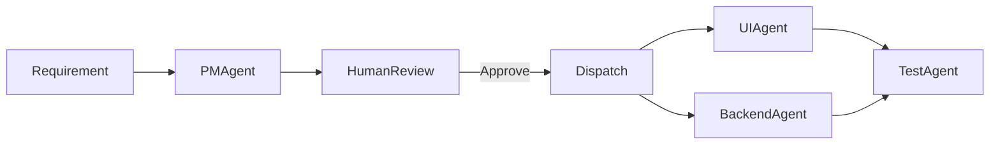

# Agentic Dev Team — Plan

You give a requirement; a Product Manager agent turns it into stories; you review and approve; two agents (UI + Backend) implement; one agent tests.

---

## The Core Loop



---

## The Critical Constraint

**The human review gate is non-negotiable.** Stories must be visible and approvable before any code is written. Everything else is secondary. If you skip this, you are building an autopilot that writes code you did not sign off on—and debugging that is a nightmare.

---

## Data First

Define the minimal schemas that flow through the system. The bottleneck is almost always your data (prompts, examples, schemas), not your orchestration. Get the data right first.

**Requirement:**
```json
{ "id": "req_1", "text": "...", "submitted_at": "2025-03-10T12:00:00Z" }
```

**Story:**
```json
{
  "id": "story_1",
  "title": "Login page",
  "description": "User can log in with email and password",
  "acceptance_criteria": ["AC1", "AC2"],
  "ownership": "frontend",
  "status": "pending_review"
}
```

**StoryPack:**
```json
{
  "id": "pack_1",
  "requirement_id": "req_1",
  "stories": [...],
  "status": "pending_review"
}
```

No ORM, no migrations in v0. Use JSON files in `./state/`. Prove the data flow before adding a database.

---

## Agent Specifications

**PM Agent.** Input: requirement text. Output: StoryPack (structured JSON). No tools. One LLM call. If it fails, the schema or prompt is wrong—fix that, not the orchestration. Do not add retries, fallbacks, or "smart" routing. Fix the prompt.

**UI Agent.** Input: Story. Output: code + PR. Tools: read/write files, git. Must run `npm run build` before considering done. If build fails, the agent failed. Fail loudly. Do not silently skip the build step.

**Backend Agent.** Same pattern. Input: Story. Output: code + PR. Tools: read/write, git. Must run `pytest` before done. Tests must pass or the task is not complete.

**Test Agent.** Input: Stories + PR links. Output: manual checklist + Playwright tests. Run the tests. Report pass/fail. Do not generate tests and then skip running them.

---

## v0: The Simplest Possible Implementation

Do not use a workflow engine. Use a Python script with sequential steps. The "orchestrator" is `main.py` with `if` statements.

Do not use a queue. Run synchronously. One requirement in, one StoryPack out. Wait for stdin approval. Then run agents in sequence (or subprocess).

Review = print stories to terminal, read `approve` or `reject` from stdin. That is it. No web UI, no Slack bot, no API. Terminal. If that is too annoying, the problem is the stories, not the interface.

State = JSON files in `./state/`. `requirement_123.json`, `storypack_123.json`. Write them, read them. Inspect them when something breaks.

Agents = Python functions that call an LLM and return structured output. No MCP, no servers, no tool protocol. Just `openai.ChatCompletion` or equivalent. Pass the prompt, parse the JSON, return it.

Goal: Run `python main.py "Build a login page"` and get to "stories printed, human approves, one agent produces a PR" in under 500 lines of Python. If you exceed 500 lines, you are over-engineering.

---

## v1: What You Add Only When v0 Works

Add a persistent store (SQLite or Postgres) only when JSON files become painful—e.g., you have 50 requirements and grep is no longer enough.

Add async/queue only when one-at-a-time becomes a bottleneck—e.g., you want to process multiple requirements concurrently.

Add a web UI for review only when terminal approval becomes annoying—e.g., you are reviewing 20 stories and stdin is miserable.

Add MCP or a tools layer only when agents need to do more than read/write files—e.g., they need to call APIs, run Docker, or interact with external systems.

Each addition must be justified by a concrete pain point from v0. No speculative architecture.

---

## What We Are Not Doing (Yet)

Multi-tenant, auth, RBAC. You are one user. Add auth when you have a second user.

Parallel FE/BE execution. Sequential is fine. Add parallel when you measure and find it is the bottleneck.

Sophisticated workflow engine (Temporal, Inngest, Step Functions). You have a linear pipeline. `if` statements are sufficient.

Kubernetes, microservices, "production-grade" anything. Run on your laptop. Add deployment when you need to run it somewhere else.

---

## Failure Modes and How to Debug

**PM produces bad stories.** Eval: would a human approve? If no, add examples to the prompt. Iterate. Do not add another agent to "fix" the PM. Fix the prompt and the schema.

**Agent produces broken code.** Add "run tests" as a gate. If tests fail, retry with the error message in the prompt. Max 2 retries. Then fail loudly. Do not retry indefinitely. Surface the failure so you can improve the prompt or add better examples.

**Review gate blocks progress.** Reduce friction. Approve-all-by-default with opt-in edit. Or single-keystroke approve (e.g., press Enter to approve). The goal is to make approval fast when stories are good, not to make approval "rigorous" when stories are bad. Fix the PM; do not slow down the human.

---

## Summary

Build v0 first. One script. JSON files. Terminal approval. One agent at a time. Get it working. Then add complexity only when you hit a concrete wall.
